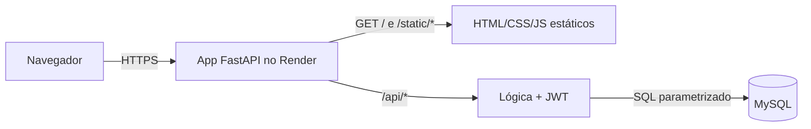
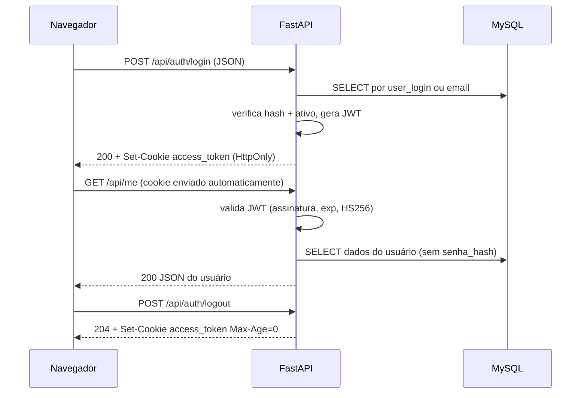

# Decisões de Arquitetura — MVP Ello Mineiro

> Planos gratuitos mudam com frequência. **Confirme limites e condições nos sites oficiais antes de criar as contas.**
>
> **Revisão 2:** front e back passam a ser servidos pela **mesma aplicação, em uma única plataforma** (mesma origem).

## 1. Visão geral



- `GET /` retorna o `index.html` (tela de login).
- Demais páginas (`cadastro.html`, `home.html`) e assets (CSS/JS) são servidos como arquivos estáticos pelo próprio backend.
- A API fica sob o prefixo `/api/*`, evitando colisão com as rotas de páginas.

### Vantagens
| Ganho | Detalhe |
|---|---|
| Sem CORS | Mesma origem: dispensa configuração de CORS e *preflight* |
| Um único deploy | Um repositório, um serviço, uma URL |
| Cookie HttpOnly viável | Sem cross-site, o cookie de sessão funciona de forma simples e mais segura |
| Front chama `/api/...` | URLs relativas, sem variável de URL da API por ambiente |

### Trade-offs
| Ponto | Mitigação |
|---|---|
| O cold start do plano grátis atinge também a página inicial | Aceitável no MVP; avisar na apresentação |
| Front e back acoplados no deploy | Adequado ao tamanho do projeto; pastas continuam separadas |
| Sem CDN para os estáticos | Irrelevante para o volume de um MVP |

## 2. Banco de dados

| Opção | Prós | Contras |
|---|---|---|
| **MySQL** (já modelado no `seed.sql`) | Zero retrabalho; é o que o README prevê | Menos hosts gratuitos |
| PostgreSQL (Neon/Supabase) | Muitos planos grátis | Exige adaptar o script (`AUTO_INCREMENT` → `GENERATED ... AS IDENTITY`) |

**Decisão proposta: MySQL**, por manter a modelagem da disciplina.

### Onde hospedar o MySQL (grátis)
| Serviço | Observação |
|---|---|
| **TiDB Cloud Serverless** (recomendado) | Compatível com MySQL, tier gratuito com armazenamento limitado |
| Aiven for MySQL (plano free) | MySQL "de verdade"; pode desligar por inatividade |
| Railway / PlanetScale | Sem plano realmente gratuito atualmente — evitar |

Plano B: migrar para **Neon (PostgreSQL)**; a mudança no script é pequena.

## 3. Aplicação (back + front na mesma plataforma)

| Item | Decisão |
|---|---|
| Linguagem/framework | **Python + FastAPI** (Swagger automático, validação com Pydantic) |
| Arquivos estáticos | `StaticFiles` do FastAPI/Starlette + rota `/` devolvendo `index.html` (`FileResponse`) |
| Acesso ao banco | **SQL puro** com driver MySQL (PyMySQL), em camada de repositório — ver [seção 7](#7-decisão-sql-puro-em-vez-de-orm) |
| Hash de senha | `argon2-cffi` (Argon2id) ou `bcrypt` |
| Token | PyJWT, HS256, expiração curta, entregue em **cookie HttpOnly** — ver [seção 5](#5-estratégia-de-autenticação) |
| Hospedagem | **Render** (Web Service gratuito) |

Alternativas de hospedagem única: Koyeb, Fly.io (podem exigir cartão). O Render é a mais simples para começar.

### Mapa de rotas

| Rota | Tipo | Retorno |
|---|---|---|
| `GET /` | Página | `index.html` (login) |
| `GET /cadastro` | Página | `cadastro.html` |
| `GET /home` | Página | `home.html` (o acesso real é protegido pela API: se `/api/me` responder `401`, o JS redireciona para `/`) |
| `GET /static/*` | Assets | CSS, JS, imagens |
| `/api/*` | API JSON | ver [01-requisitos.md](01-requisitos.md) |
| `GET /health` | API | Verificação de saúde |
| `GET /docs` | Swagger | Documentação (considerar desativar em produção) |

> **Atenção:** servir `home.html` publicamente não é falha de segurança, pois ele não contém dados. Os dados só vêm de `/api/me`, que exige autenticação. A proteção real está **sempre na API**.

## 4. Resumo da stack proposta

| Camada | Escolha | Custo |
|---|---|---|
| Front + API | HTML/CSS/JS servidos pelo FastAPI, no Render | R$ 0 |
| Banco | MySQL no TiDB Cloud Serverless | R$ 0 |
| Segredos | Variáveis de ambiente do Render | R$ 0 |
| Código | GitHub (deploy automático a cada push) | R$ 0 |

## 5. Estratégia de autenticação

**Status: decidido.** O JWT é entregue e transportado em **cookie `HttpOnly`**. A alternativa `sessionStorage` + `Authorization: Bearer` foi descartada.

**Motivo:** com front e API na mesma origem, o cookie `HttpOnly` é a opção mais segura e também a de front mais simples. O JavaScript não consegue ler o token, o que reduz o impacto de um eventual XSS (o token não pode ser roubado e usado fora do navegador).

### Atributos do cookie
| Atributo | Valor | Por quê |
|---|---|---|
| Nome | `access_token` | Identificação única |
| `HttpOnly` | sim | JS não lê o cookie (proteção contra roubo por XSS) |
| `Secure` | sim | Enviado só por HTTPS. Navegadores aceitam em `http://localhost`; configurável por variável de ambiente (`COOKIE_SECURE`) para desenvolvimento |
| `SameSite` | `Lax` | Não é enviado em `POST` vindo de outros sites (mitiga CSRF) |
| `Path` | `/` | Válido para páginas e `/api/*` |
| `Max-Age` | igual ao `exp` do JWT (ex.: 3600) | Cookie e token expiram juntos |
| `Domain` | não definido | Cookie restrito ao host exato |

### Fluxo


- O backend lê o token **do cookie** em uma dependência do FastAPI usada por toda rota protegida; sem cookie ou token inválido/expirado → `401`.
- O corpo do login **não** contém o token.
- No front, `fetch('/api/...')` envia o cookie sozinho (padrão `credentials: 'same-origin'`); não há código para guardar ou anexar token.
- O hash da senha é feito apenas no backend.

### Proteção contra CSRF (RNF18)
Como o navegador envia o cookie automaticamente, as rotas que alteram estado precisam de proteção:
1. `SameSite=Lax` (principal barreira no MVP).
2. Alterações de estado apenas por `POST` com `Content-Type: application/json` (formulários HTML de outros sites não conseguem enviar JSON sem *preflight*, e o CORS não está habilitado).
3. Checar o header `Origin` nos `POST`: se presente e diferente do host da aplicação → `403`.
4. Nenhuma rota `GET` altera dados.

### Limitações aceitas no MVP
| Limitação | Tratamento |
|---|---|
| O logout apaga o cookie, mas um token copiado antes continua válido até expirar | Expiração curta (RNF08). Revogação fica para o futuro ([03-regras-futuras.md](03-regras-futuras.md) §7) |
| XSS ainda pode fazer requisições em nome do usuário enquanto a página está aberta | Evitar `innerHTML` com dados do usuário (usar `textContent`) e definir `Content-Security-Policy` |
| Cliente mobile ou outro domínio no futuro | Poderá ganhar rota com `Authorization: Bearer`, mantendo o cookie para o navegador |
| Testar no Swagger (`/docs`) | Funciona: o Swagger roda na mesma origem e o navegador envia o cookie após o login |

## 6. Estrutura de pastas sugerida

```
ello-mineiro-mvp/
├── docs/
├── database/            # seed.sql, migrações
├── app/                 # código FastAPI
│   ├── main.py          # monta StaticFiles e rotas
│   ├── db.py            # conexão/pool com o MySQL (variáveis de ambiente)
│   ├── repositories/    # TODO o SQL fica aqui (usuarios.py, enderecos.py, permissoes.py)
│   ├── routers/         # auth, me (chamam os repositórios, nunca escrevem SQL)
│   └── ...
├── frontend/            # servido pelo backend
│   ├── index.html       # login (rota "/")
│   ├── cadastro.html
│   ├── home.html
│   └── static/          # css, js
├── requirements.txt
└── .env.example
```

## 7. Decisão: SQL puro em vez de ORM

**Status: decidido.** O projeto usa SQL puro (PyMySQL), sem ORM.

**Motivo:** o trabalho é em grupo e a disciplina é de banco de dados. Ver os `SELECT`, `INSERT` e `UPDATE` no código reduz a curva de aprendizagem da equipe e deixa explícito o que acontece no banco.

### Regras do time
1. **Todo SQL fica em `app/repositories/`.** Rotas e regras de negócio chamam funções como `buscar_por_email()` ou `criar_usuario()`.
2. **Sempre queries parametrizadas** (`%s` + tupla de parâmetros). **Proibido** montar SQL com f-string, `+` ou `.format()` (risco de SQL Injection).
3. Nunca selecionar `senha_hash` fora da função de login; demais consultas listam as colunas explicitamente (sem `SELECT *`).
4. Operações com mais de um comando (ex.: usuário + endereço) rodam em **transação** (`commit` / `rollback`).
5. A fonte da verdade do esquema é o `database/seed.sql`; mudanças são feitas nele e comunicadas ao grupo.
6. Fechar conexões/cursores (usar `with` ou pool).

### Exemplo do padrão
```python
# app/repositories/usuarios.py
def buscar_por_identificador(conn, identificador):
    sql = """
        SELECT id, user_login, email, senha_hash, permissao_nome, ativo
        FROM Usuarios
        WHERE user_login = %s OR email = %s
    """
    with conn.cursor() as cur:
        cur.execute(sql, (identificador, identificador))
        return cur.fetchone()
```

### Consequências
| Positivo | A gerenciar |
|---|---|
| Código didático e alinhado à matéria | Mais código repetitivo (mapear linha → dicionário) |
| Poucas dependências, comportamento previsível | Segurança depende da disciplina do time (regra 2) |
| Reaproveita direto o `seed.sql` | Sem migrações automáticas: versionar scripts em `database/` |
| Camada de repositório isolada | Migrar para ORM no futuro exige reescrever só essa camada |

Sugestão: revisar em *code review* que nenhum PR contenha SQL fora de `repositories/` ou concatenação de strings em queries.

## 8. Perguntas em aberto

1. ~~Perfil no cadastro~~ → **decidido:** o cadastro não pede perfil; todo usuário nasce com o perfil padrão `Usuario`. Demais perfis serão liberados no futuro pelo setor administrativo — ver [01-requisitos.md](01-requisitos.md) e [03-regras-futuras.md](03-regras-futuras.md).
1a. ~~Padrão do `user_login`~~ → **decidido:** nome de usuário escolhido pelo próprio usuário (3–30 caracteres, `a-z 0-9 . _`, único). A matrícula e o registro funcional são identificadores separados, previstos para fases futuras.
2. ~~ORM ou SQL puro~~ → **decidido: SQL puro** (seção 7).
3. ~~JWT em cookie HttpOnly ou `sessionStorage`~~ → **decidido: cookie `HttpOnly; Secure; SameSite=Lax`** (seção 5). Login responde com `Set-Cookie` (sem token no corpo) e existe `POST /api/auth/logout`.
4. Manter MySQL ou migrar para PostgreSQL caso o host gratuito falhe?

## 9. Roteiro sugerido

1. Fechar as decisões acima.
2. ~~Ajustar `seed.sql`~~ (feito, agora em `database/seed.sql`) e criar o banco no TiDB Cloud.
3. Backend: `/health` → servir `index.html` em `/` → `register` → `login` → `me` → `logout`.
4. Front: login, cadastro, home (chamando `/api/...` com URLs relativas).
5. Deploy único no Render e testes de ponta a ponta.
