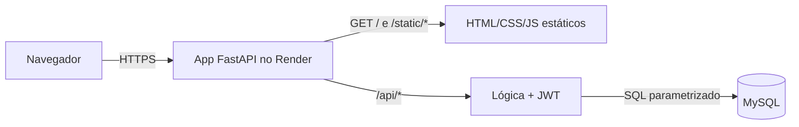

# Decisões de Arquitetura — MVP Ello Mineiro

> Planos gratuitos mudam com frequência. **Confirme limites e condições nos sites oficiais antes de criar as contas.**
>
> **Revisão 2:** front e back passam a ser servidos pela **mesma aplicação, em uma única plataforma** (mesma origem).

## 1. Visão geral



- `GET /` retorna o `index.html` (tela de login).
- Demais páginas (`cadastro.html`, `home.html`) e assets (CSS/JS) são servidos como arquivos estáticos pelo próprio backend.
- A API fica sob o prefixo `/api/*`, evitando colisão com as rotas de páginas.

### Vantagens
| Ganho | Detalhe |
|---|---|
| Sem CORS | Mesma origem: dispensa configuração de CORS e *preflight* |
| Um único deploy | Um repositório, um serviço, uma URL |
| Cookie HttpOnly viável | Sem cross-site, o cookie de sessão funciona de forma simples e mais segura |
| Front chama `/api/...` | URLs relativas, sem variável de URL da API por ambiente |

### Trade-offs
| Ponto | Mitigação |
|---|---|
| O cold start do plano grátis atinge também a página inicial | Aceitável no MVP; avisar na apresentação |
| Front e back acoplados no deploy | Adequado ao tamanho do projeto; pastas continuam separadas |
| Sem CDN para os estáticos | Irrelevante para o volume de um MVP |

## 2. Banco de dados

| Opção | Prós | Contras |
|---|---|---|
| **MySQL** (já modelado no `seed.sql`) | Zero retrabalho; é o que o README prevê | Menos hosts gratuitos |
| PostgreSQL (Neon/Supabase) | Muitos planos grátis | Exige adaptar o script (`AUTO_INCREMENT` → `GENERATED ... AS IDENTITY`) |

**Decisão proposta: MySQL**, por manter a modelagem da disciplina.

### Onde hospedar o MySQL (grátis)
| Serviço | Observação |
|---|---|
| **TiDB Cloud Serverless** (recomendado) | Compatível com MySQL, tier gratuito com armazenamento limitado |
| Aiven for MySQL (plano free) | MySQL "de verdade"; pode desligar por inatividade |
| Railway / PlanetScale | Sem plano realmente gratuito atualmente — evitar |

Plano B: migrar para **Neon (PostgreSQL)**; a mudança no script é pequena.

## 3. Aplicação (back + front na mesma plataforma)

| Item | Decisão |
|---|---|
| Linguagem/framework | **Python + FastAPI** (Swagger automático, validação com Pydantic) |
| Arquivos estáticos | `StaticFiles` do FastAPI/Starlette + rota `/` devolvendo `index.html` (`FileResponse`) |
| Acesso ao banco | SQLAlchemy ou PyMySQL puro (mais didático para BD) |
| Hash de senha | `argon2-cffi` (Argon2id) ou `bcrypt` |
| Token | PyJWT, HS256, expiração curta |
| Hospedagem | **Render** (Web Service gratuito) |

Alternativas de hospedagem única: Koyeb, Fly.io (podem exigir cartão). O Render é a mais simples para começar.

### Mapa de rotas

| Rota | Tipo | Retorno |
|---|---|---|
| `GET /` | Página | `index.html` (login) |
| `GET /cadastro` | Página | `cadastro.html` |
| `GET /home` | Página | `home.html` (o acesso real é protegido pela API: sem token válido, o JS redireciona para `/`) |
| `GET /static/*` | Assets | CSS, JS, imagens |
| `/api/*` | API JSON | ver [01-requisitos.md](01-requisitos.md) |
| `GET /health` | API | Verificação de saúde |
| `GET /docs` | Swagger | Documentação (considerar desativar em produção) |

> **Atenção:** servir `home.html` publicamente não é falha de segurança, pois ele não contém dados. Os dados só vêm de `/api/me`, que exige autenticação. A proteção real está **sempre na API**.

## 4. Resumo da stack proposta

| Camada | Escolha | Custo |
|---|---|---|
| Front + API | HTML/CSS/JS servidos pelo FastAPI, no Render | R$ 0 |
| Banco | MySQL no TiDB Cloud Serverless | R$ 0 |
| Segredos | Variáveis de ambiente do Render | R$ 0 |
| Código | GitHub (deploy automático a cada push) | R$ 0 |

## 5. Estratégia de autenticação

Com mesma origem, a opção mais segura fica simples:

- **Recomendado:** JWT em cookie `HttpOnly; Secure; SameSite=Lax`. O JavaScript não consegue lê-lo, o que reduz o impacto de XSS. Requer proteção contra CSRF nas rotas que alteram dados (`SameSite` já mitiga bastante no MVP).
- **Alternativa mais simples:** JWT retornado no corpo e guardado em `sessionStorage`, enviado no header `Authorization: Bearer`. Mais fácil de entender, porém exposto a XSS.
- O backend valida o token em toda rota protegida (dependência do FastAPI).
- O hash da senha é feito apenas no backend.

## 6. Estrutura de pastas sugerida

```
ello-mineiro-mvp/
├── docs/
├── database/            # seed.sql, migrações
├── app/                 # código FastAPI
│   ├── main.py          # monta StaticFiles e rotas
│   ├── routers/         # auth, me
│   └── ...
├── frontend/            # servido pelo backend
│   ├── index.html       # login (rota "/")
│   ├── cadastro.html
│   ├── home.html
│   └── static/          # css, js
├── requirements.txt
└── .env.example
```

## 7. Perguntas em aberto

1. Cadastro público cria só `Aluno` (opção A) ou escolha livre (B)? — ver [01-requisitos.md](01-requisitos.md)
2. Usar ORM (SQLAlchemy) ou SQL puro (mais alinhado à matéria de BD)?
3. JWT em cookie HttpOnly (recomendado agora) ou `sessionStorage`?
4. Manter MySQL ou migrar para PostgreSQL caso o host gratuito falhe?

## 8. Roteiro sugerido

1. Fechar as decisões acima.
2. Ajustar `seed.sql` e criar o banco no TiDB Cloud.
3. Backend: `/health` → servir `index.html` em `/` → `register` → `login` → `me`.
4. Front: login, cadastro, home (chamando `/api/...` com URLs relativas).
5. Deploy único no Render e testes de ponta a ponta.
